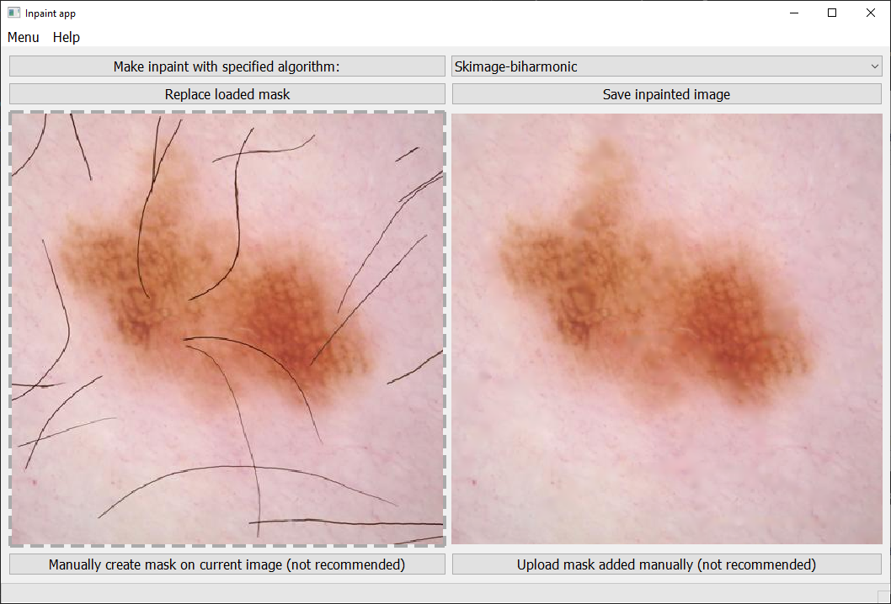
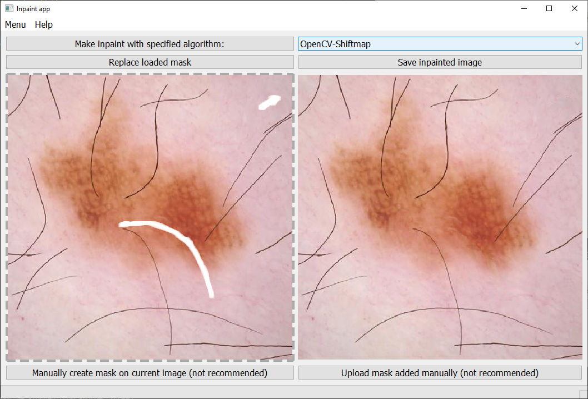

# Inpaint app

Author: Radosław Szpot

## About

The purpose of the app is to make inpaint and see result in one place.
User can choose the best algorithm for his problem and save inpainted image.

## Usage Example

To run the app you need to open cmd in path and run commend `make start`.

After running app correctly window should look like this:  

Now you can add image which needs inpainting by dropping graphic file to dashed line rectangle in window.  

Next step is to upload mask (or create it manually on image) and select algorithm from combo box in upper right corner. Then click "Make inpaint with specified algorithm" and voilà your inpainted image will be displayed on right. Now if you are satisfied you can save image to selected path.

Working with manually added mask isn't perfect but also works.

## Motivation:

As part of my engineering degree work, I utilized inpainting algorithms which proved to be highly effective. I believe that with the addition of a user-friendly GUI, these algorithms could be easily implemented for efficient photo corrections. While for me it was an opportunity to gain a better understanding of the Pyqt library and create an interesting project.

The images presented in the "Usage Example" section were created based on the ISIC database by a scientific group with whom I had the pleasure of collaborating and contributing some images.

## Technology:

- The project was implemented in Python, which is the programming language I like the most.
- For inpaint purposes libraries OpenCV and scikit-image were used.
- For creating GUI Pyqt5 were used.

## Project future development

Possible future features are pointed in file [TODO](TODO.md)
