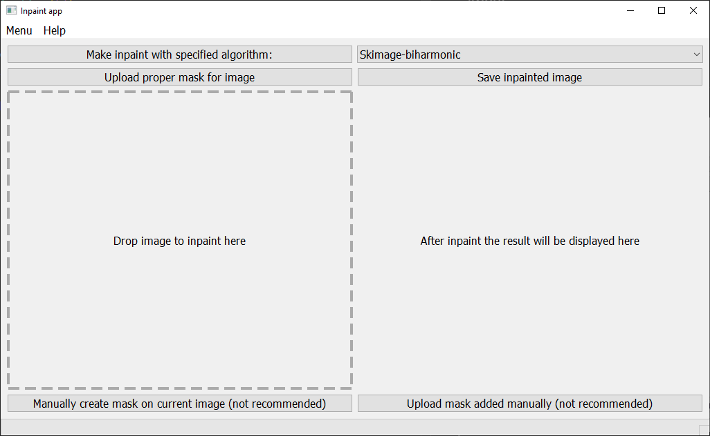

# Inpaint app 
Author: Radosław Szpot

### About
The goal of the app is to make inpaint and see result in one place. 
User can choose the best algorithm for his problem and save inpainted image.

### Usage Example
To run the app you need to ...   

After running correctly app window should look like this:  

Now user should add image which needs inpainting by dropping graphic file to window.  

### Motivation:
Algorithms for inpaint were used from part of my Engineer Degree work. 
I thought that they work really well and could be easily implemented with some GUI 
to help creating fast photos corrections.

### Technology:
* Project was realised in Python language as it is my most used language.
* For creating GUI I used Pyqt5. ...
* For inpaint purposes libraries OpenCV and scikit-image were used.

### Project future development
Possible future features are pointed in file [TODO](TODO.md)